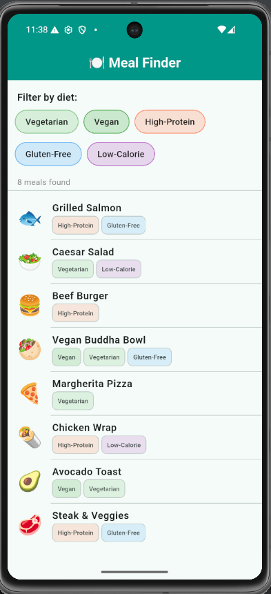
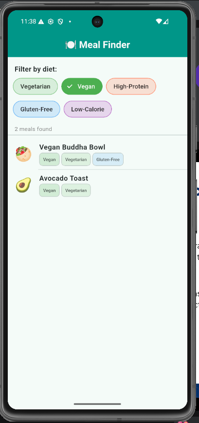
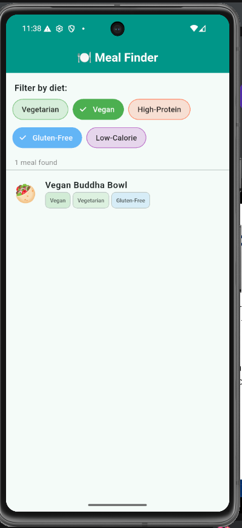
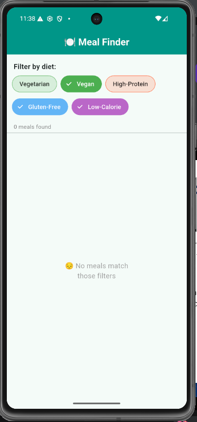

# 🍽️ FilterChip Widget Demo

A Flutter app that lets users filter a meal list by dietary tags using Flutter's `FilterChip` widget. Built as a simple, real-world demo to show how chips can power interactive UI filtering.

---

## 🚀 Getting Started

Make sure you have Flutter installed, then follow these steps:

1. **Clone the repo**
   ```bash
   git clone https://github.com/mutabazi-bruno/Widget-Presentation.git
   ```

2. **Navigate into the project**
   ```bash
   cd Widget-Presentation/chip
   ```

3. **Install dependencies**
   ```bash
   flutter pub get
   ```

4. **Run the app**
   ```bash
   flutter run
   ```

---

## 🧩 About the Widget

`FilterChip` is a Material Design chip that supports a selected/unselected toggle state — perfect for building filter UIs. In this demo, tapping a chip filters the meal list to only show meals that match all selected dietary tags.

---

## 🔑 Three Key Attributes

### 1. `label`
Sets the text displayed on the chip. In this app, each chip shows a diet category like *"Vegetarian"*, *"Vegan"*, or *"High-Protein"*.

```dart
label: Text(tag)
```

### 2. `backgroundColor`
Controls the chip's background color when it's **not** selected. In this app, each tag has its own color at 25% opacity, giving a subtle tinted look before the chip is activated.

```dart
backgroundColor: tagColors[tag]!.withOpacity(0.25)
```

### 3. `onSelected`
A callback that fires whenever the user taps the chip. This is where the filter state gets updated — adding or removing the tag from the active filter set.

```dart
onSelected: (bool selected) {
  setState(() {
    if (selected) {
      _selectedFilters.add(tag);
    } else {
      _selectedFilters.remove(tag);
    }
  });
}
```

---

## 📸 Screenshots

| Main UI | Vegan Filter Active |
|---|---|
|  |  |

| Vegan + Gluten-Free | No Matches |
|---|---|
|  |  |